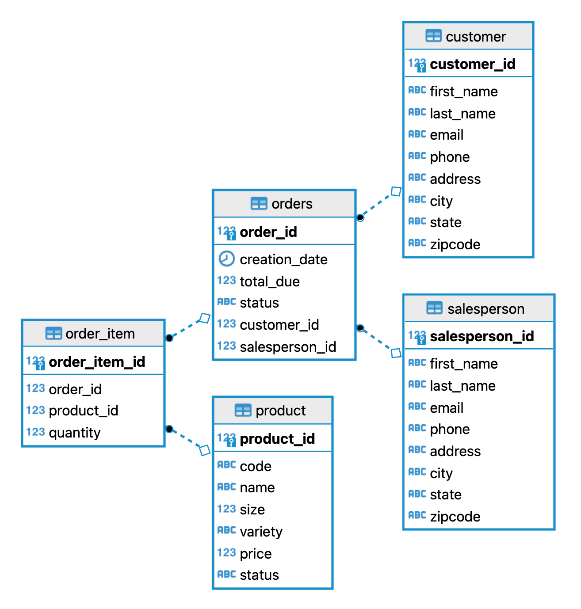

# Introduction

This project creates a database typical of a storefront keeping records for products, orders, salespeople, and customers. The PSQL database can then be manipulated in Java through the JDBC API to facilitate query formation and execution with a PSQL driver acting as an interface. Data Access Objects were introduced to act as interfaces when accessing the Customer and Order tables in the database. The code was written in IntelliJ IDEA, with the project managed with Maven.

# Implementaiton
## ER Diagram

## Design Patterns

This project was later adapted to use the Data Access Object design pattern, which is often compared and contrasted with the Repository design pattern. In this case, I feel that a DAO implementation is a better fit than a Repository for a few reasons. The DAO pattern essentially decouples the application and the database by acting as an interface, hides ugly queries, and generally more closely represents the table as an object from Java's perspective. A Repository design would also access data and hide queries, but under the hood is closer to the application/business logic side. A DAO will perform joins in the database, whereas a Repository will perform joins in Java. This gives an edge in performance to DAO since database operations are generally more efficient than Java. However, in the case where not all of the relevant data is stored on a single node, DAO is unviable. This makes Repositories suitable for horizontally scaling distributed databases. Since the database in this project is normalized and stored entirely on a single node, DAO is the better choice here.

# Test

The app was tested by hand. I manually went through the execution of the code to check if queries fetched the expected output, if the database would be updated correctly on write/updates, and if the DAO properly handled invalid queries.
