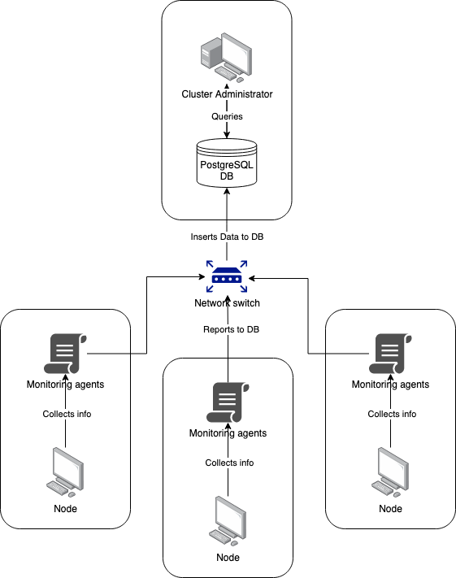

# Linux Cluster Monitoring Agent

# Introduction
This project automates collection system specifications and monitoring resource usage of nodes in a Linux server cluster. This is achieved by running info collection scripts automatically every 5 minutes and gathers them in a database. This database can then be queried for average memory usage over 5 minute intervals and detect host node failures.

Server admins can use this tool to gauge load on their servers and allow them to make informed decisions about server upgrades, load allocation. We use PostgreSQL for our database, containerized and managed with Docker. Shell scripts are used for automated setup of the database and collecting node specs/usage info. Finally, a .sql script compiles and displays useful aggregate information.

# Quick Start
- Start a psql instance using psql_docker.sh:

  `bash ./scripts/psql_docker.sh create [db_username] [db_password]`
- Create tables using ddl.sql:
  
  `psql -h [host] -U [db_username] -d host_agent -f sql/ddl.sql`
- Insert hardware specs data into the DB using host_info.sh:
  
  `bash ./scripts/host_info.sh [host] [port] host_agent [db_username] [db_password]`
- Insert hardware usage data into the DB using host_usage.sh:
  
  `bash scripts/host_usage.sh [host] [port] host_agent [db_username] [db_password]`
- Crontab setup:

  `crontab -e`
  
  Then add this to crontab:
  
  `* * * * * bash /path/to/project/host_agent/scripts/host_usage.sh [host] [port] host_agent [db_username] [db_password]`

# Implemenation
Discuss how you implement the project.

## Architecture

## Scripts
- `psql_docker.sh create [db_username] [db_password]`
  
  Create new psql instance with Docker, with given username and password. Fails if instance already exists.
  
  `psql_docker.sh start`
  
  Starts psql instance on Docker. Fails if no instance exists.
  
  `psql_docker.sh stop`
  
  Stops psql instance on Docker. Fails if no instance exists.
  
- `host_info.sh [host] [port] [db_name] [db_username] [db_password]`
  
  Parses and collects specifications of host machine and inserts to database.
  
- `host_usage.sh [host] [port] [db_name] [db_username] [db_password]`
  
  Parses and collects usage details of host machine and inserts to database.
  
- `crontab`

  Used to manage running host_usage.sh periodically. We add `* * * * * bash /path/to/project/host_agent/scripts/host_usage.sh [host] [port] [db_name] [db_username] [db_password]` to crontab.
  
- `queries.sql`
  
  3 queries are included in this script.
  
    1. Group hosts by hardware info
    2. Fetch average memory usage per 5 minute interval
    3. Detect host failure

## Database Modeling
- `host_info`

Column|Type|Description
---|---|---
id|`SERIAL PRIMARY KEY`|Database ID
hostname|`VARCHAR UNIQUE`|Name of host
cpu_number|`INT`|Number of CPUs
cpu_architecture|`INT`|CPU architecture
cpu_model|`VARCHAR`|Name of CPU model
cpu_mhz|`INT`|Clock speed of CPU in MHz
L2_cache|`INT`|Size on L2 cache in kB
total_mem|`INT`|Total memory in kB
timestamp|`TIMESTAMP`|Time this data was collected

- `host_usage`

Column|Type|Description
---|---|---
timestamp|`TIMESTAMP`|Time this data was collected
host_id|`SERIAL`|ID of host in database
memory_free|`INT`|Amount of free memory in MB
cpu_idle|`INT`|% of time CPU spent idle
cpu_kernel|`INT`|% of time CPU used by kernel
disk_io|`INT`|Number of disk I/O
disk_available|`INT`|Amount of available disk space in MB

# Test
How did you test your bash scripts and SQL queries? What was the result?

# Deployment
How did you deploy your app? (e.g. Github, crontab, docker)

# Improvements
Write at least three things you want to improve
e.g.
- handle hardware update
- blah
- blah
